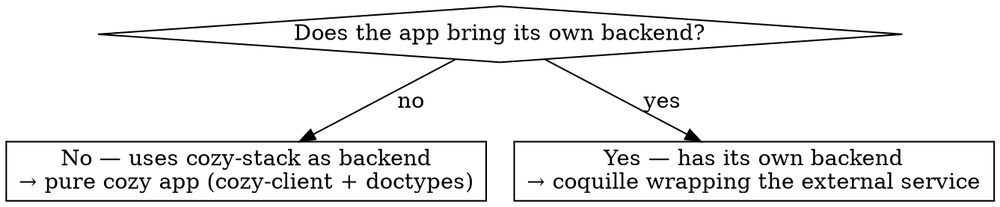

# Create a new Twake / Cozy web app

Apply when starting a **new** Twake/Cozy web app that will be published on the Cozy
registry. This covers the choice of app shape, the scaffold, the mandatory Sentry
wiring, and the publish CI. It stops at "ready to publish"; use `twake-cozy-dev-env`
to run and test it locally, and the convention skills to write its code.

The repo can live anywhere on GitHub — typically the developer's own user first,
not an org. No org or editor is imposed.

## 1. The one decision that shapes everything: where is the backend?

Both shapes converge on the same Sentry + publication setup (sections 4–5).

## 2. Pure cozy app (backend = cozy-stack)

- Scaffold from **`cozy/cozy-app-template`** (rsbuild, `manifest.webapp`, eslint flat
  config, jest). Prefer it to the older `cozy/create-cozy-app` CLI.
- Fill `manifest.webapp`: `slug`, `name`, `version`, `type: "webapp"`, `editor`,
  `icon`, `licence`, `categories`, `routes`, and **`permissions`** scoped to the real
  doctypes the app reads/writes.
- Write the code per the convention skills: `twake-cozy-client` (queries/doctypes),
  `twake-react-conventions`, `twake-javascript-conventions` / `twake-typescript-conventions`.

## 3. Coquille (backend = the app's own service)

Reference apps: **`cozy/cozy-twakechat`**, **`cozy/cozy-twakemail`**,
**`cozy/cozy-twakecalendar`**. These are **not** raw iframes — they are thin, real
cozy-client apps (`AppProviders` + `client` + `AppRouter`) with the same rsbuild
scaffold as the template.

The coquille points to its external service through a **cozy flag** named in the
manifest:

- `manifest.webapp` → **`client_url_flag`** = the flag holding the service URL.
  **Nomenclature: `<slug>.embedded-app-url`** (e.g. `chat.embedded-app-url`). Respect it.
- Also set `name_prefix` (e.g. `"Twake"`), `developer` (`{ name, url }`), and — if a
  companion mobile app exists — the `mobile` block (`schema` deep-link,
  `id_playstore`, `id_appstore`).
- The Twake wrappers use `editor: "Cozy"` + `name_prefix: "Twake"`, not `editor: "Twake"`.

## 4. Sentry (mandatory) — errors.cozycloud.cc

Every published app reports to the self-hosted Sentry. Match what real apps do
(e.g. cozy-drive), no more:

- Create a **new project** on `errors.cozycloud.cc` → get **its own DSN** (one project
  per app; do not reuse another app's DSN).
- Add `@sentry/react` and `src/lib/sentry.js` with `Sentry.init({ dsn, release:
  appMetadata.version, environment, integrations, tracesSampleRate, ignoreErrors })`.
  The **DSN is hard-coded in the source** (not env-injected), like every existing app.
- **No source-map upload / sentry-cli / SENTRY_AUTH_TOKEN** — no cozy app does this.
  `release` from the app version is the whole release story.

> The current Twake coquilles (`cozy-twakechat` …) ship **without** Sentry. That is a
> gap to close on a new app, **not** a pattern to copy.

## 5. Publication on the Cozy registry + CI

Copy the pattern from a reference app (twakechat / cozy-drive):

- `package.json` script: `cozyPublish` = `cozy-app-publish --token $REGISTRY_TOKEN --prepublish downcloud`.
- Copy `.github/workflows/ci-cd.yml` (lint → build → publish) and
  `create-bump-pr.yml` (version bump PR).
- **Channels are driven by git ref:** push to `master` → **dev**; tag `X.Y.Z` →
  **stable**; tag `X.Y.Z-beta.N` → **beta**.
- **Secrets to provide (human):** `REGISTRY_TOKEN` (issued for the registry editor) and
  `DOWNCLOUD_SSH_KEY` (the `downcloud` prepublish pushes the build over SSH).
- **Reserve the slug + editor on the registry** before the first publish.

## 6. Production pitfalls — CSP

Locally the stack is often served with **`--disable-csp`**; production enforces a
**strict CSP** (`connect-src` / `font-src` limited to self). Anything that works locally
but calls an external origin will break in production.

- **Remedy (real cozy-drive pattern): self-host external assets** — fonts, wasm,
  scripts — instead of loading them from a CDN. CSP is enforced by cozy-stack; the app
  cannot whitelist origins itself.
- **Coquille:** confirm the service URL (`client_url_flag`) is reachable under the
  production CSP.
- Validate under a CSP-enabled environment (`twake-cozy-dev-env`), never trust local
  `--disable-csp`.

## 7. Don't forget

`.nvmrc`, i18n/locales, theming (twake-mui first, cozy-ui fallback — see
`twake-react-conventions`), `README`, `LICENSE` (AGPL-3.0 like the Twake wrappers),
`icon`/assets.

## Boundaries

- Run/test locally → `twake-cozy-dev-env`.
- Branch, commit, PR → `twake-git-conventions`.
- Write the app code → the `twake-*-conventions` skills.
